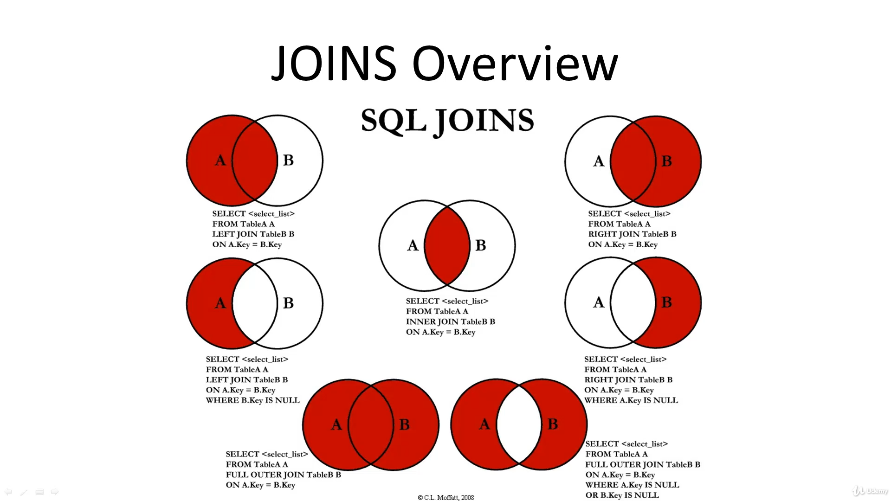
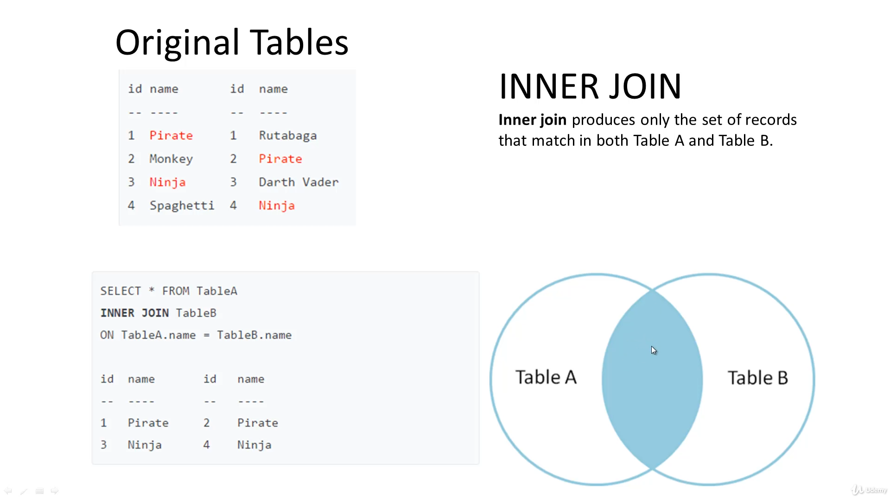
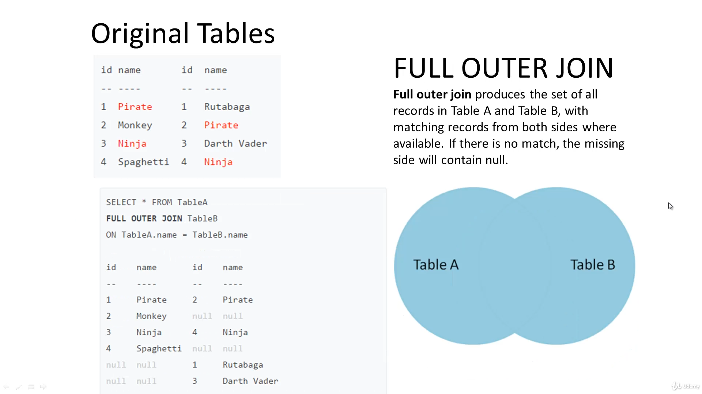
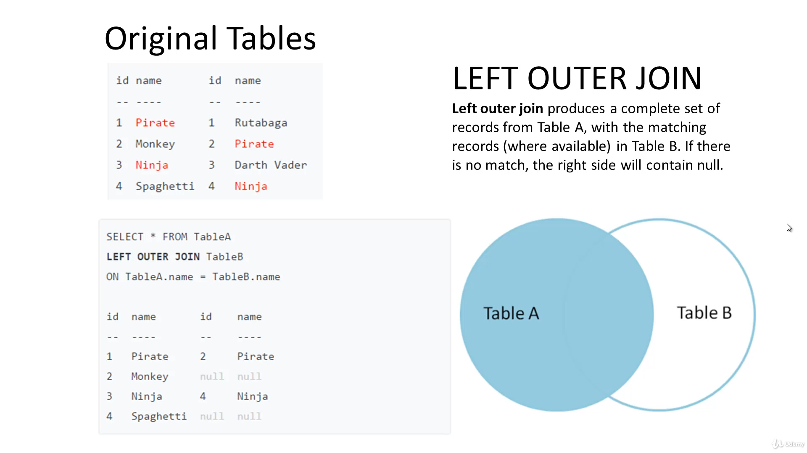
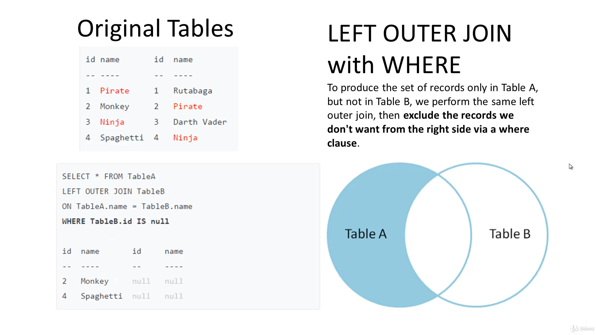
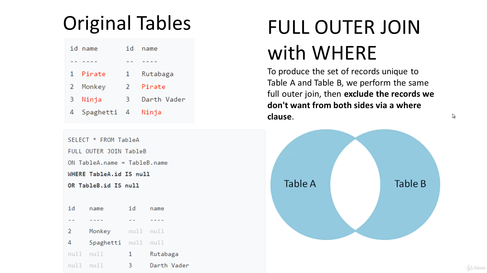

第一篇 部落格測試文章


<!-- more -->

::: tip
如果在這有看到什麼問題，可以在下方留言
又或者可以在 [Github](https://github.com/kevinypfan) 發布 Issue 或者 PR 。
:::

### Functions

- `AVG(column)` - 平均值
- `ROUND(value, length)` - 平均值
- `MIN()`
- `SUM()`
- `MAX()`
- `COUNT()`

### SELECT

```sql
SELECT * FROM db_table;
```

### DISTINCT

```sql
SELECT DISTINCT data_key * FROM table_name;
```

table_name 裡，data_key 有哪些不同 key 的集合。

ex: [a, a, a, b, b, d, e] => {a, b, d, e}

### WHERE

```sql
SELECT column_1, column_2....
From table_name
WHERE conditions;
```

| OPERATOR | DESCRPTION     |
| -------- | -------------- |
| =        | 等於           |
| >        | 大於           |
| <        | 小於           |
| >=       | 大於等於       |
| <=       | 小於等於       |
| <> or != | 不等於         |
| AND      | 邏輯運算子 AND |
| OR       | 邏輯運算子 OR  |

ex:

```sql
SELECT last_name, first_name
FROM customer
WHERE first_name = 'Jamie' AND last_name = 'Rice';
```

### BETWEEN

```sql
SELECT customer_id, amount FROM payment
WHERE amount NOT BETWEEN 8 AND 9;
```

```sql
SELECT amount, payment_date FROM payment
WHERE payment_date BETWEEN '2007-02-07' AND '2007-02-15';
```

### IN

列出 customer_id 等於 1 與 2 的資料

```sql
SELECT * FROM rental WHERE customer_id IN (1,2);
```

等於以下

```sql
SELECT * FROM rental WHERE customer_id = 1
OR customer_id = 2;
```

### COUNT

有幾筆資料在此 table 內。

```sql
SELECT COUNT(*) FROM table;
```

資料表內，有幾個不同的 Keys

```sql
SELECT COUNT(DISTINCT column) FROM table;
```

### LIMIT

從 table_name 取 10 筆資料

```sql
SELECT * FROM table_name LIMIT 10;
```

### ORDER BY

預設為 ASC 排序由小到大

```sql
SELECT first_name, last_name FROM table_name
ORDER BY first_name ASC;
```

此為倒序

```sql
SELECT first_name, last_name FROM table_name
ORDER BY first_name DESC;
```

### LIKE

- Percent (%) for matching any sequence of characters.
- Underscore (\_) for matching any single character.

```sql
SELECT first_name, last_name From customer
WHERE first_name LIKE '_ev%';
```

ILIKE -> no matter capitalization

```sql
SELECT first_name, last_name From customer
WHERE first_name ILIKE '_ev%';
```

### GROUP BY

將相同數值者並在一起，下列可計算同一名用戶所有的消費金額總計

```sql
SELECT customer_id, SUM(amount)
FROM payment
GROUP BY customer_id
ORDER BY customer_id;
```

### HAVING

加入條件，選取想要的資料

```sql
SELECT customer_id, SUM(amount)
FROM payment GROUP BY customer_id
HAVING SUM(amount) > 180 AND SUM(amount) < 199;
```

### JOINS

把 payment 依照 customer_id 把欄位接入 customer

```sql
SELECT * FROM customer
INNER JOIN payment ON payment.customer_id = customer.customer_id;
```







